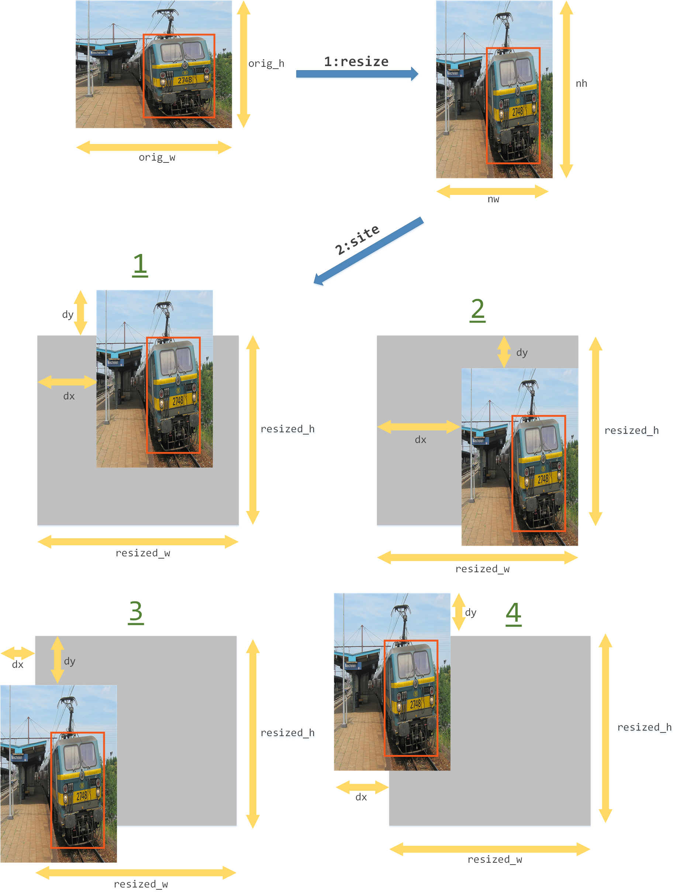
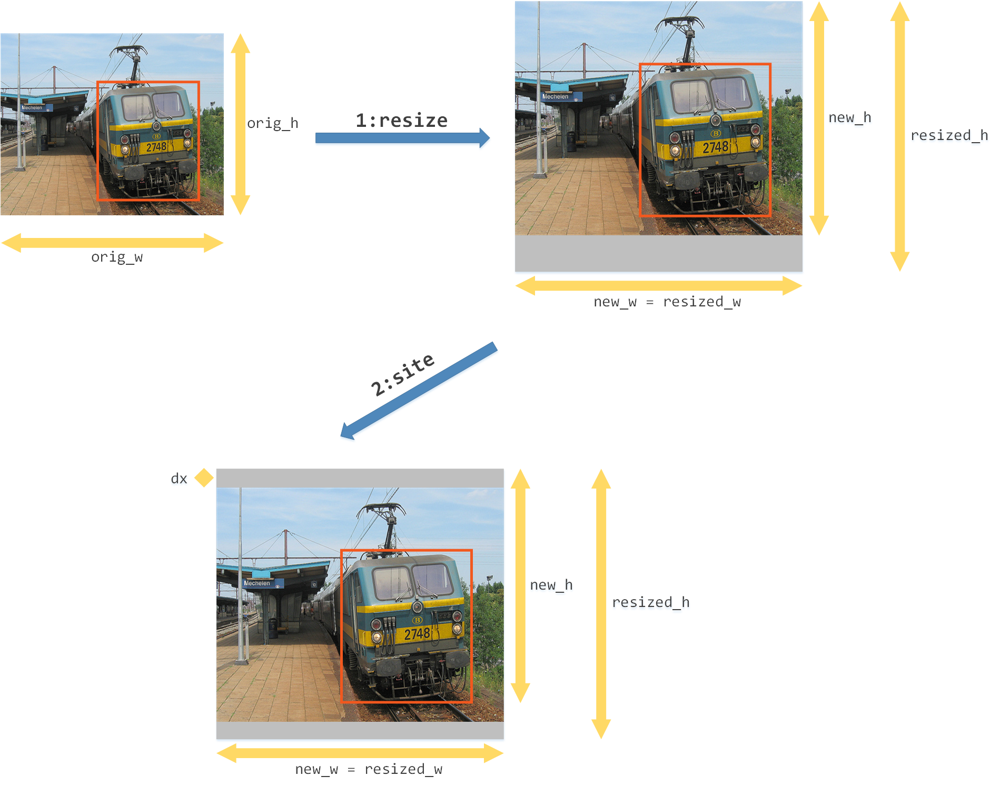

# tensorflow版本的YOLO-v1


## 1. 模型介绍

### 1.1. 数据预处理

对于图片的预处理大致分为3步，分别为resize，flip和whiten。并且在图片预处理的resize和flip步骤中，需要对标签（真实物体框的位置）进行变换。具体步骤如下，

1.  **resize**：对于一张尺寸为(orig_w, orig_h, 3)的图片，首先将图片进行缩放成尺寸为(nw, nh, 3)的图片，然后初始化尺寸为(resized_w, resized_h, 3)的灰色画布，最后随机出左上角的坐标(dx, dy)，将缩放后的图片放置在(dx, dy)位置。值得注意的是，在进行图片变换之后，需要将真实物体框（图中红色框）的尺寸和位置进行相应的变换。具体步骤如下图所示。

    

2.  **flip**：将变换之后的图片按照一定的概率进行左右翻转，对应的，真实物体框的位置也要进行左右翻转。

3.  **whiten**：将图片进行z-score归一化，将图片tensor的每一个元素减去均值之后除以标准差。

在训练的每一个batch中，首先进行数据预处理步骤之后，可以获得尺寸为(batch_size, w, h, 3)的图片数据，以及尺寸为(batch_size, max_objects, 5)的标签数据，标签数据的最后一个维度的5个元素分别表示，物体框的中心横坐标x，中心纵坐标y，宽度w，高度h以及物体类别index。这两个tensor作为网络的**输入变量**，具体尺寸位image: (64, 448, 448, 3)，label: (64, 30, 5)。


### 1.2 网络结构

YOLO的网络结构是多层深度卷积神经网络来提取图片特征信息，然后回归出物体框的坐标信息、置信度信息以及类别信息，具体网络结构如下。

-   **卷积层1**：卷积核大小3\*3，卷积核移动步长1，卷积核个数16，池化大小2*2，池化步长2，池化类型为最大池化，激活函数leaky-ReLU，使用batch normalization。
-   **卷积层2**：卷积核大小3\*3，卷积核移动步长1，卷积核个数32，池化大小2*2，池化步长2，池化类型为最大池化，激活函数leaky-ReLU，使用batch normalization。
-   **卷积层3**：卷积核大小3\*3，卷积核移动步长1，卷积核个数64，池化大小2*2，池化步长2，池化类型为最大池化，激活函数leaky-ReLU，使用batch normalization。
-   **卷积层4**：卷积核大小3\*3，卷积核移动步长1，卷积核个数128，池化大小2*2，池化步长2，池化类型为最大池化，激活函数leaky-ReLU，使用batch normalization。
-   **卷积层5**：卷积核大小3\*3，卷积核移动步长1，卷积核个数256，池化大小2*2，池化步长2，池化类型为最大池化，激活函数leaky-ReLU，使用batch normalization。
-   **卷积层6**：卷积核大小3\*3，卷积核移动步长1，卷积核个数512，池化大小2*2，池化步长2，池化类型为最大池化，激活函数leaky-ReLU，使用batch normalization。
-   **卷积层7**：卷积核大小3\*3，卷积核移动步长1，卷积核个数1024，激活函数leaky-ReLU，使用batch normalization。
-   **卷积层8**：卷积核大小3\*3，卷积核移动步长1，卷积核个数1024，激活函数leaky-ReLU，使用batch normalization。
-   **卷积层9**：卷积核大小3\*3，卷积核移动步长1，卷积核个数125(=5\*(1+4+20))，激活函数leaky-ReLU。
-   **分类层**：将125维向量转化为(5, 25)，最后一维的前5位加上sigmoid分类层，最后一维的后20位加上softmax分类层。

最终网络的输出tensor尺寸位(64, 7, 7, 5, 25)，网络结构如图所示。


### 1.3. 目标函数

#### anyobject loss

anyobject loss用以约束所有应该预测出没有物体的预测框(pred box)的5维信息，即这些预测框对应的5维向量(x, y, w, h, c)应该接近于(0, 0, 0, 0, 0)。反映在目标函数中，表示为，
$$
\sum_{x=1}^M \sum_{y=1}^M \sum_{j=1}^B \bf{1}_{xyj}^{noobj} (c_{xyj} - \hat{c}_{xyj})^2 , c_{xyj}=0
$$
反映在伪代码中，

```python
anyobject_mask = numpy.zeros((n_cell, n_cell, n_boxes, 1), dtype=float)
for x in range(n_cell):
  for y in range(n_cell):
    for j in range(n_boxes):
      pred_box = pred_boxes[x,y,j,0:4]
      max_iou = 0
      for k in range(max_objects):
        true_box = true_boxes[k,0:4]
        iou = calculate_iou(pred_box, true_box)
        if iou >= max_iou:
          max_iou = iou
      if max_iou > anyobject_thresh:
        anyobject_mask[x,y,j,0] = 1.0
anyobject_true = numpy.zeros((n_cell, n_cell, n_boxes, 1), dtype=float)
anyobject_pred = predict[:,:,:,4:]
anyobject_loss = l2_loss((anyobject_true - anyobject_pred) * anyobject_mask)
```


#### coord loss, object loss, class loss

coord loss用以约束所有应该预测出物体的预测框的前4维坐标信息，即这些预测框对应的4维坐标向量(xp, yp, wp, hp)应该接近于真实的物体坐标信息(xt, yt, wt, ht)。反映在目标函数中，表示为，
$$
\sum_{x=1}^M \sum_{y=1}^M \sum_{j=1}^B \bf{1}_{xyj}^{obj} \left[ (x_{xyj} - \hat{x}_{xyj})^2 + (y_{xyj} - \hat{y}_{xyj})^2 + (\sqrt{w}_{xyj} - \sqrt{\hat{w}}_{xyj})^2 + (\sqrt{h}_{xyj} - \sqrt{\hat{h}}_{xyj})^2 \right]
$$
object loss用以约束所有应该预测出物体的预测框的第5维置信度，即这些预测框对应的置信度cp应该接近于1。反映在目标函数中，表示为，
$$
\sum_{x=1}^M \sum_{y=1}^M \sum_{j=1}^B \bf{1}_{xyj}^{obj} (c_{xyj} - \hat{c}_{xyj})^2 , c_{xyj}=1
$$
class loss用以约束所有应该预测出物体的预测框的第6到N+5维类别信息，若真实的类别为第n类，那么这个预测框对应的第n维应该接近于1，第6到N+5维中其余的维度应该接近于0。反映在目标函数中，表示为，
$$
\sum_{x=1}^M \sum_{y=1}^M \sum_{j=1}^B \bf{1}_{xyj}^{obj} (p_{xyj} - \hat{p}_{xyj})^2
$$
指的注意的是，类别为n的真实框所覆盖的所有cell对应的类别信息，都应该是第n维为1，其余为0，而非只是真实框的中心点覆盖的cell。反映在伪代码中，

```python
object_mask = numpy.zeros((n_cell, n_cell, n_boxes, 1), dtype=float)
coord_loss, object_loss, class_loss = 0.0, 0.0, 0.0
for k in range(max_objects):
  true_box = true_boxes[k,0:4]
  cell_x, cell_y = int(true_box[0]), int(true_box[1])
  max_iou, max_index = 0, 0
  for j in range(n_boxes)
  	pred_box = pred_boxes[cell_x,cell_y,j,0:4]
    iou = calculate_iou(pred_box, true_box)
    if iou >= max_iou:
      max_iou = iou
      max_index = j
  object_mask[cell_x,cell_y,j,0] = 1.0
  
  coord_true = numpy.tile(true_boxes[k,0:4], [n_cell,n_cell,n_boxes,4])
  coord_pred = predict[:,:,:,0:4]
  coord_loss += l2_loss((coord_true - coord_pred) * object_mask)
  
  object_true = numpy.ones((n_cell,n_cell,n_boxes,1), dtype=float)
  object_pred = predict[:,:,:,4:5]
  object_loss += l2_loss((object_true - object_pred) * object_mask)
  
  class_true = numpy.zeros((n_cell,n_cell,n_boxes,n_class), dtype=float)
  class_true[cell_x,cell_y,:,4+true_boxes[k,5]] = 1.0
  class_pred = predict[:,:,:,5:]
  class_loss += l2_loss((class_true - class_pred) * object_mask)
```


### 1.4. 模型测试

测试模块的任务是，给定任意的一张图片，根据训练好的模型预测出所有$p(class)$高于阈值thresh的物体框。具体步骤如下，

1.  **图片预处理**：对于一张尺寸为(orig_w, orig_h, 3)的图片，需要resize成尺寸为(resized_w, resized_h, 3)的图片然后输入到网络中。因此，首先将图片保持原始比例进行缩放，然后初始化尺寸为(resized_w, resized_h, 3)的灰色画布，将缩放后的图片放置在画布的正中央。具体步骤如下图所示。

    

2.  **模型预测**：将尺寸为(resized_w, resized_h, 3)的图片输入到模型，然后输出模型的predict变量，predict变量为一个尺寸为(batch_size, cell_size, cell_size, n_boxes, 5+n_classes)的tensor，表示了每个cell中，每个box预测出的物体框位置信息、置信度信息以及类别信息。置信度信息即$p(object)$，类别信息即$p(class|object)$，将二者相乘得到$p(class)$，如果$p(class) > thresh_{predict}$，则认为该box预测中有物体并且对应的类别为$p(class)$最大的类别。这样，模型就可以输出boxes和probs分别表示预测的物体的位置和概率。

3.  **物体框后处理**：对于所有预测出的物体框，如果有两个物体框预测的类别相同，并且$IOU > thresh_{combine}$，那么就将$p(class)$较小的那个框移除，这样获得的预测物体框为最终的预测结果。