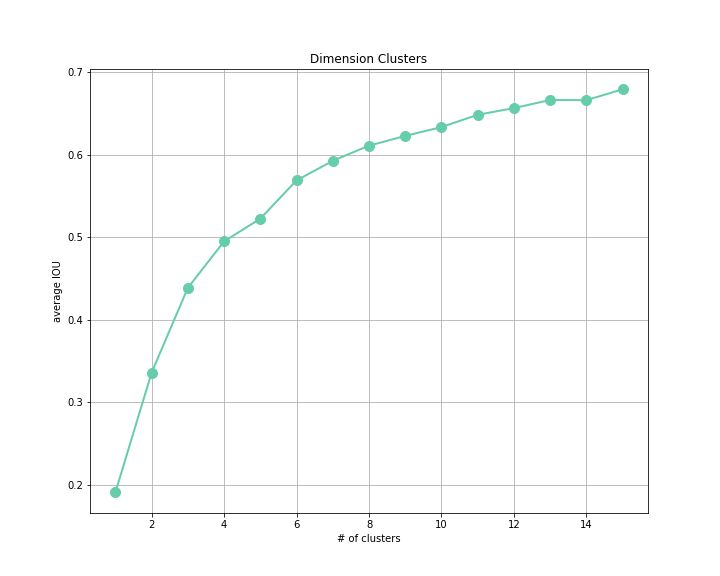

# table-v1

## 1. 数据预处理

对文档中的数字、时间、页码、文字的单元格设置不同的颜色，获得的图片作为数据集的图片，标签为图片中的表格位置。

从训练集中读取图片和标签，对图片进行尺寸变换，变换成尺寸为 (224, 224, 3) 的tensor，不进行其他数据预处理步骤，将这个tensor作为网络的输入。

## 2. 网络结构

yolo-v1中提出的19层卷积网络，网络的结构如下表。

| Name   | Filter             | Input            | Output           |
| ------ | ------------------ | ---------------- | ---------------- |
| conv1  | (7 * 7 * 64 / 2)   | (224 * 224 * 3)  | (112 * 112 * 64) |
| pool1  | (2 * 2 / 2)        | (112 * 112 * 64) | (56 * 56 * 64)   |
| conv2  | (3 * 3 * 192 / 1)  | (56 * 56 * 64)   | (56 * 56 * 192)  |
| pool2  | (2 * 2 / 2)        | (56 * 56 * 192)  | (28 * 28 * 192)  |
| conv3  | (1 * 1 * 128 / 1)  | (28 * 28 * 192)  | (28 * 28 * 128)  |
| conv4  | (3 * 3 * 256 / 1)  | (28 * 28 * 128)  | (28 * 28 * 256)  |
| conv5  | (1 * 1 * 128 / 1)  | (28 * 28 * 256)  | (28 * 28 * 128)  |
| conv6  | (3 * 3 * 256 / 1)  | (28 * 28 * 128)  | (28 * 28 * 256)  |
| pool3  | (2 * 2 / 2)        | (28 * 28 * 256)  | (14 * 14 * 256)  |
| conv7  | (1 * 1 * 256 / 1)  | (14 * 14 * 256)  | (14 * 14 * 256)  |
| conv8  | (3 * 3 * 512 / 1)  | (14 * 14 * 256)  | (14 * 14 * 512)  |
| conv9  | (1 * 1 * 512 / 1)  | (14 * 14 * 512)  | (14 * 14 * 512)  |
| conv10 | (3 * 3 * 1024 / 1) | (14 * 14 * 512)  | (14 * 14 * 1024) |
| pool4  | (2 * 2 / 2)        | (14 * 14 * 1024) | (7 * 7 * 1024)   |
| conv11 | (1 * 1 * 512 / 1)  | (7 * 7 * 1024)   | (7 * 7 * 512)    |
| conv12 | (3 * 3 * 1024 / 1) | (7 * 7 * 512)    | (7 * 7 * 1024)   |
| conv13 | (3 * 3 * 1024 / 1) | (7 * 7 * 1024)   | (7 * 7 * 1024)   |
| dense1 | (4096)             | (50176)          | (4096)           |
| dense2 | (1274)             | (4096)           | (1274)           |

网络输出为 (7 \* 7 \* (1 + 5 \* 5)) ，表示尺寸为7的网格，分类类别个数为1，每个网格预测5个box，每个box需要预测4个坐标信息和1个置信度值。

使用的一些网络提升技术有如下：

-   batch normalization：epsilon设置为0.00005，gamma使用全1初始化，beta使用全0初始化。
-   leaky relu：alpha设置为0.1。
-   weight decay：decay rate设置为0.0005。
-   response normal：depth设置为7，alpha设置为0.001，beta设置为0.75。
-   dropout：在网络dense1层使用dropout，训练时keep设置为0.5，预测时keep设置为1。

## 3. 训练过程

-   坐标目标函数值 (coord loss) 权重设为5，物体识别目标函数值 (object loss) 权重设为 1，无物体识别目标函数值 (noobject loss) 权重设为0.5，分类目标函数值 (class loss) 权重设为1。
-   计算召回率时，超过召回率阈值 (recall thresh) 的物体才作为识别准确的物体，阈值设置为0.5。
-   计算背景识别率时，小于背景阈值 (no object thresh) 才作为识别准确的背景，阈值设置为0.6。
-   数据批大小 (batch size) 设置为64。
-   优化器使用MomentumOptimizer，momentum值设置为0.9。
-   学习率使用固定值，设置为0.001。

## 4. 结果分析

训练过程中，图片处理速度为 75 images/sec。

训练过程观测这些信息：loss、class loss、coord loss、object loss、nobject loss、iou、object、nobject、recall。

验证过程观测这些信息：iou、object、nobject、recall。

训练和验证曲线如下。

# table-v2

数据预处理不进行改进

## 1. 网络结构

根据yolo-v2中提出的dimension clusters和direct location prediction进行改进。

### dimension clusters

对所有训练集中的box进行聚类，以（1 - 和质心box的iou值）做为距离进行聚类，聚类中心分别设置为1~15，每次聚类迭代50轮，并且计算每个box到距离其最近的质心的iou值作为聚类评估指标，绘制如下的折线图。可以观察到，选择 cluster = 6 时，既可以获得很高的IOU，也可以获得较低的计算复杂度。

